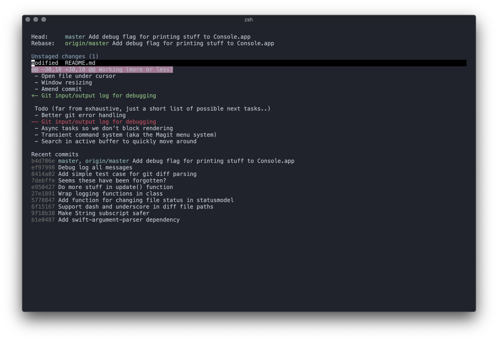

# goose

**So alpha it hurts. This is just a toy right now, so please don’t use it for anything serious. Let me be the one destroying my
git repos, not you.**

Goose is a git client for your terminal. It is highly inspired by the best git client ever created – magit. It strives to be more
or less identical, with the only difference being that it lives in your terminal, and not in your Emacs.

## Rationale
[Magit](https://magit.vc) is probably the best git client/porcelain around. My only problem is that it lives inside Emacs,
and even though I really enjoy using Emacs I don’t like being tied to one single tool for all my needs. Hence, I try to move
the best git client out of the best code editor and make it stand alone.

What could possibly go wrong.

## Status

Working (more or less)
- Untracked files, worktree changes and index changes as diff
- Stage section / file / hunk
- Unstage section / file / hunk
- Discard section / file / hunk
- Commiting
- Listing log
- Display commit content
- UI: Information line
- UI: scrolling
- Open file under cursor
- Window resizing
- Amend commit
- Git input/output log for debugging

Todo (far from exhaustive, just a short list of possible next tasks..)
- Better git error handling
- Transient command system (aka the Magit menu system)
- Search in active buffer to quickly move around
- Stashes
- Optimizations
- Stage / unstage /discard lines
- Binary files?
- ... soooo much more

Bugs
- Diffs with tab characters (and possibly others) breaks rendering

## Instructions

- Run: `make run`
- Build debug: `make debug`
- Build production: `make build`
- Install: `make install`
- Uninstall: `make uninstall`
- Clean: `make clean`

## References

Useful references to get the functionality just right

- [The official Magit documentation](https://github.com/magit/magit/blob/master/Documentation/magit.org)
- [edamagit – Magit for VSCode](https://github.com/kahole/edamagit)

## Attribution

The [tea library](libraries/tea) is inspired (and some stuff copied) from [Ashen](https://github.com/colinta/Ashen).
